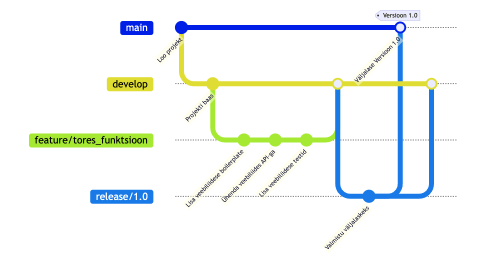

# Digiloovtöö GitHubis

Maia Lust

Martti Raavel

---

## Millest juttu tuleb?

- Git ja GitHub
- GitHubi struktuur
- Projektihaldus GitHubis
- Dokumentatsioon GitHubis
- Kasutajate haldus
- Muude asjade sees pisut terminoloogiat
- ...

---

## Millest juttu ei tule?

- Versioonihalduse põhimõtted
- Git-i käsud ja töövood
- ...

---

## Mis on Git ja mis on Github?

- Git on hajutatud versioonihaldussüsteem, mis on loodud Linus Torvaldsi poolt Linuxi tuumiku arendamiseks.
- Hajutatud tähendab, et iga kasutaja töötab oma kohaliku koopiaga 'originaalist' ja muudatused saab üles laadida serverisse.
- GitHub on veebipõhine platvorm, mis pakub Git-i haldamiseks lisateenuseid.

---

## GitHubi struktuur

- Organisatsioon (Organization)
- Repositoorium (Repository)
- Issued (Issues)
- Wiki
- Discussions
- Projects

---

## Organisatsioon (Organization)

Organisatsioon on GitHubi üksus, mis võimaldab hallata mitut repositooriumi ja kasutajaid ühes kohas. Sobib hästi meeskondadele ja ettevõtetele.

---

## Repositoorium (Repository)

Repositoorium on koht (põhimõtteliselt nagu kaust), kus hoitakse projekti faile, sealhulgas koodi, dokumentatsiooni ja muud seotud materjale. Iga repositoorium võib sisaldada:

- Koodi
- Wiki
- Issues
- Projects
- Discussions
- Ja palju muud

Lisaks on repositooriumil erinevad seaded ja õigused, mida saab hallata vastavalt meeskonna vajadustele, nagu näiteks ligipääsuõigused, nähtavus (avalik/privaatne) jne.

---

## Issued (Issues)

Issued on GitHubi tööriist, mis võimaldab jälgida ülesandeid, vigu ja funktsioonisoove. Iga issue saab sisaldada:

- Pealkirja
- Kirjeldust
- Kommentaare
- Sildid (labels)
- Assignees (määratud isikud)
- Milestones (tähtajad)
- ...

---

## Wiki

Wiki on GitHubi sisseehitatud dokumentatsioonisüsteem, mis võimaldab luua ja hallata projekti dokumentatsiooni struktureeritud viisil.

---

## Discussions

Discussions on GitHubi foorumilaadne tööriist, mis võimaldab meeskonnaliikmetel arutada ideid, esitada küsimusi ja jagada teavet.

---

## Projects

Projects on GitHubi tööriist, mis võimaldab hallata ülesandeid ja töövooge Kanban-tahvlite abil. Sobib hästi sprintide ja iteratsioonide planeerimiseks.

Projects-i ülesanded on seotud repsoitooriumis olevate issue-dega ja neil saavad olla samad omadused, mis issue-del (sildid, assignees jne).

Lisaks on võimalik näiteks kasutada GitHub Projects-i Iterations funktsionaalsust, et hallata sprinte.

---

## Mallid

GitHub võimaldab luua repositooriume mallidena (Template Repositories), mida teised kasutajad saavad kopeerida oma uue projekti alustamiseks.

Lisaks saab luua malle Issuede jaoks (Issue Templates), mis aitavad standardiseerida ülesannete loomist.

---

## Automaatika GitHubis

Github Actions võimaldab lisad repositooriumisse erinevat tüüpi automaatikat, näiteks:

- automaatne Issuede loomine repositooriumi loomisel mallist
- automaatne Issue sulgemine
- koodi testimine
- ...

---

## Projektihaldus GitHubis

- Tahvlid (Kanban, Roadmap)
- Ülesanded (Issues)
- Sprintide haldamine (Iterations, Milestones)
- Sildid (Labels)
- Vastutajad (Assignees)
- ...

---

## Dokumentatsioon GitHubis

GitHub ja Git üldiselt töötab väga hästi tekstifailidega, eriti Markdown formaadis.

Lisaks on võimalik kasutada GitHubi Wiki-d, mis on mugav viis projekti dokumentatsiooni haldamiseks.

GitHub Discussions võimaldab luua foorumeid, kus meeskonnaliikmed saavad arutada ideid ja jagada teavet.

---

## README.md fail

README.md on Markdown formaadis tekstifail, mis asub repositooriumi juurkataloogis ja annab ülevaate projektist.

Lisaks võib README.md faile lisada ka alamkaustadesse erineva informatsiooni jaoks.

README.md fail on selle poolest eriline, et kaustas olevat README.md faili kuvatakse GitHubis automaatselt kaustavaates.

---

## Markdown

Markdown on kerge märgendikeel, millel on lihtne tekstivormingu süntaks. See loodi John Gruber-i poolt 2004. aastal. Markdowni peamine eesmärk oli muuta inimestel teksti kirjutamine ja vormindamine lihtsaks viisil, mis on vabalt loetav ja mida saab konverteerida HTML-iks (või teisteks väljundvorminguteks).

---

## Märgendikeel

Märgendikeel on keel, mida kasutatakse teksti vormindamiseks või struktureerimiseks, lisades märgendeid või märke. Märgendid on tavaliselt mingid sümbolid või sümbolite kombinatsioonid, mis on lisatud teksti, et määratleda, millist vormingut või struktuuri mingi tekst peaks omama. Märgendikeeli kasutatakse laialdaselt dokumentatsioonis, veebilehtede loomisel, blogimises ja paljudes muudes kontekstides.

---

## Markdowni eelised

- Lihtsus
- Loetavus
- Paindlik väljund/konvertimise võimalused
- Levinud tugi platvormidel nagu GitHub, GitLab, Discord jne
- Versioonihalduse sõbralik
- Pole vaja spetsiaalseid tööriistu

GitHub toetab Markdowni nii dokumentide (README.md, Wiki) kui ka kommentaaride ja issue-de puhul.

---

## Kasutajate haldus

- Teams (Organisatsioonides)
  - Liikmete grupeerimine
  - Õiguste haldamine meeskonniti
- Repositooriumi liikmed (Collaborators)
  - Erinevad õigused (Read, Write, Admin)
- Project Permissions
  - Õiguste haldamine projektitasandil (repositooriumist eraldi)

---

## Ülevaate saamine

- Insights -> Contributors (individuaalne panus)
- Projects (tahvli jälgimine)
- Wiki (dokumentatsiooni jälgimine)
- ...

---

## Küsimused ja tagasiside

---

## Kui tahad rohkem GitHubist teada saada

Reedel räägin, kuidas me Haapsalus GitHubi kasutame

---
